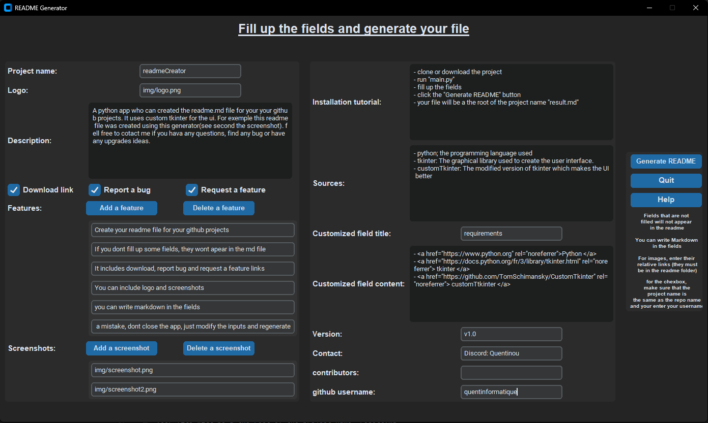

# readmeCreator

---

A python app who can created the readme.md file for your your github projects. It uses custom tkinter for the ui. For exemple this readme file was created using this generator(see second the screenshot). fell free to cotact me if you hava any questions, find any bug or have any upgrades ideas.

-<a href="https://github.com/quentinformatique/readmeCreator/releases/latest">Download</a>--<a href="https://github.com/quentinformatique/readmeCreator/issues/new/choose">Report a bug</a>--<a href="https://github.com/quentinformatique/readmeCreator/issues/new/choose">Request a feature</a>-

## Features

---
- Create your readme file for your github projects
- If you dont fill up some fields, they wont apear in the md file
- It includes download, report bug and request a feature links
- You can include logo and screenshots
- you can write markdown in the fields
- if you did a mistake, dont close the app, just modify the inputs and regenerate
## Screenshots

---

## Installation

---
- clone or download the project
- run "main.py"
- fill up the fields
- click the "Generate README" button
- your file will be a the root of the project name "result.md"

## Sources
---
- python; the programming language used
- tkinter: The graphical library used to create the user interface.
- customTkinter: The modified version of tkinter which makes the UI better

## requirements

---
- <a href="https://www.python.org" rel="noreferrer">Python </a>
- <a href="https://docs.python.org/fr/3/library/tkinter.html" rel="noreferrer"> tkinter </a> 
- <a href="https://github.com/TomSchimansky/CustomTkinter" rel="noreferrer"> customTtkinter </a> 

## Contact: 

---
Discord: Quentinou
## Version: v1.0
